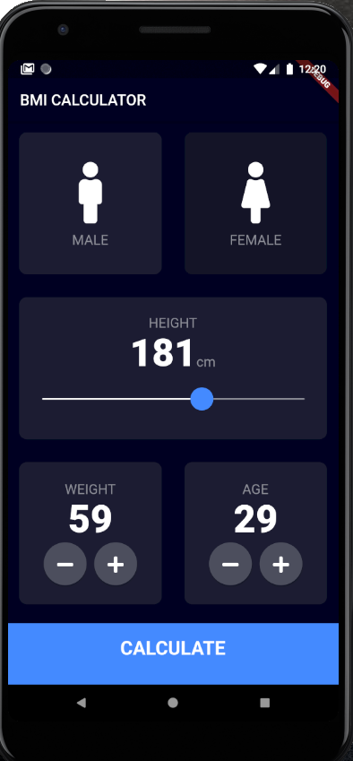
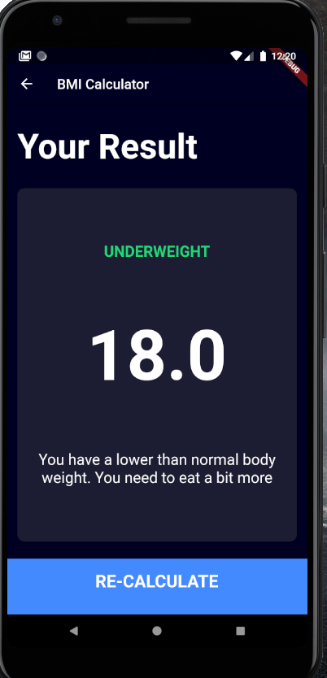

# BMI Calculator 

Another App I build while learning Flutter from Angela Yu on Udemy Platform. 

Here is the demo - 
 
 
  
 
 

## Things I learned while making this App -
1. Custom themes using themedata 
2. Working with multiple pages 
3. Difference between const and final 
4. Use of Expanded Widget
5. Using flutter outline to remove replicated code (Extracting Widget)
6. Creating custom widgets 
7. Learned about enums in Dart
8. Turnary operators in Dart 
9. Passing functions as params 
10. Creating Sliders
11. Composing own widgets from base widgets. 
12. Creating multiscreen applications 

